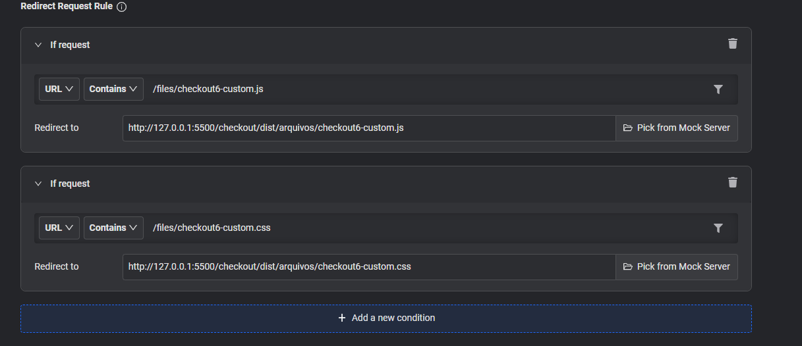
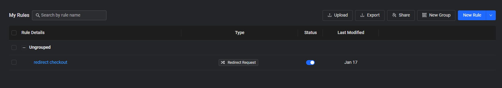
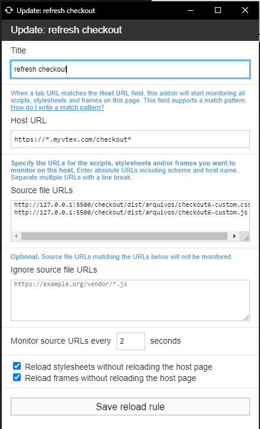
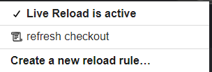

# softwares requeridos para que o live reload funcione corretamente

* navegador - extensão LiveReload (testei apenas com google chrome)
https://chrome.google.com/webstore/detail/live-reload/jcejoncdonagmfohjcdgohnmecaipidc

* navegador - extensão Requestly (testei apenas com google chrome)
https://chrome.google.com/webstore/detail/redirect-url-modify-heade/mdnleldcmiljblolnjhpnblkcekpdkpa

* visual studio code - extensão Live Server
https://chrome.google.com/webstore/detail/live-reload/jcejoncdonagmfohjcdgohnmecaipidc

---

# configurando cada software
## Descobrindo o endereço que será utilizado pelo Requestly
1. com o vscode aberto e a extensão live server instalada, abra um servidor local com a opção "Live Server: open with live server" (normalmente esta na barra de busca em ctrl + p)
2. vai se abrir uma nova pagina no chrome. Nessa nova pagina, vá para a pasta checkout/dist/arquivos
3. Você vai chegar na pasta aonde os arquivos são minificados pelo gulpjs.Caso não tenha os arquivos "checkout6-custom.css" e "checkout6-custom.js" presentes na pasta, gere eles rodando yarn dev no terminal e salvando algum arquivo .js e .css presentes no diretorio de checkout
4. guarde o link (na doc será utilizada o link http://127.0.0.1:5500/checkout/dist/arquivos/ como exemplo) - ele será utilizado no proximo passo

## Configurando a extensão Requestly
1. Baixe a extensão
2. Entre no app (normalmente https://app.requestly.io/rules/my-rules)
3. Aperte em "Create your first rule"
4. Aperte em Redirect Request
5. Copie o conteudo abaixo
### Configuração utilizada na imagem  
`/files/checkout6-custom.js`  
`http://127.0.0.1:5500/checkout/dist/arquivos/checkout6-custom.js`  
`/files/checkout6-custom.css`  
`http://127.0.0.1:5500/checkout/dist/arquivos/checkout6-custom.css`  
 

Feito isso, temos o nosso requestly configurado. A partir de agora basta ativar o redirect.
O painel deverá ficar assim:
### Exemplo Painel 

## Configurando a extensão Live Reload
1. selecione a extensão
2. aperte em create a new reload rule
3. copie a configuração da imagem abaixo
### Configuração utilizada na imagem  
`https://*.myvtex.com/checkout*`  
`http://127.0.0.1:5500/checkout/dist/arquivos/checkout6-custom.css`  
`http://127.0.0.1:5500/checkout/dist/arquivos/checkout6-custom.js`  
 
4. save reload rule

---

# Após finalizar as configurações, vamos fazer funcionar:

1. vá para o diretorio /checkout do projeto
2. rode o comando "yarn"
3. rode o comando "yarn dev"
4. abra um servidor local com a opção "Live Server: open with live server"
5. vá para o checkout de qualquer loja (https://ghaus.myvtex.com/checkout/#/cart)
6. salve algum arquivo .scss/.js
7. recarregue a pagina (f5)
8. faça as devidas alterações nos arquivos scss/js e veja a pagina ser atualizada instataneamente

# ⛔ Caso não atualize, é importa checar se:
1. existe alguma diferença entre os caminhos passados em ambas as extensões do navegador.
2. o ws atual esta utilizando service worker. Quando utilizado, as requisições feitas pela extensão live reload podem ser interceptadas após a primeira chamada, e isso impede da pagina ser atualizada
3. Se o Live Reload esta ativo:  
 
4. Verificar se em outro ws ou loja o live reload esta funcionando
5. verificar se foi utilizado o comando "yarn" para baixar as dependencias
